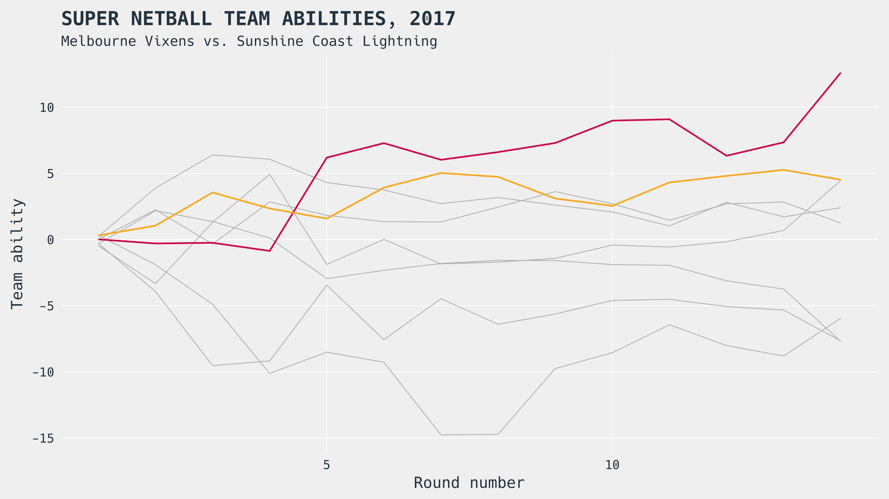

layout: true
class: left, top
background-image: url(../assets/logos/fast-banana.svg)
background-size: 215px
background-position: right top

---
class: center, middle
background-image: 


.bigr[[https://www.example.com/](https://www.example.com/)]

<!-- Time-stamp: <2017-09-04 07:25:42 (slane)> -->

---
class: inverse, center, middle
background-image: 

# Here we go!

```{r,knitr-setup,echo=FALSE,warning=FALSE,message=FALSE,cache=FALSE,results="hide"}
library(dplyr)
knitr::opts_chunk$set(cache = FALSE, error = FALSE, warning = FALSE,
                      message = FALSE, echo = TRUE)
options(digits = 2)

```

---
class: center, middle



.logo-overlay[]

---
class: top, left

# Colophon

<i class="fa fa-twitter fa-2x" aria-hidden="true"></i>.bigr[[@mytwitter](https://twitter.com/)]

<i class="fa fa-github fa-2x" aria-hidden="true"></i>.bigr[[mygithub](https://github.com)]

<i class="fa fa-user fa-2x" aria-hidden="true"></i>.bigr[[https://www.example.com/](https://www.example.com/)]

</br>

.footnote[
All views presented within are the author's only, and do not necessarily represent the views of the author.
]
